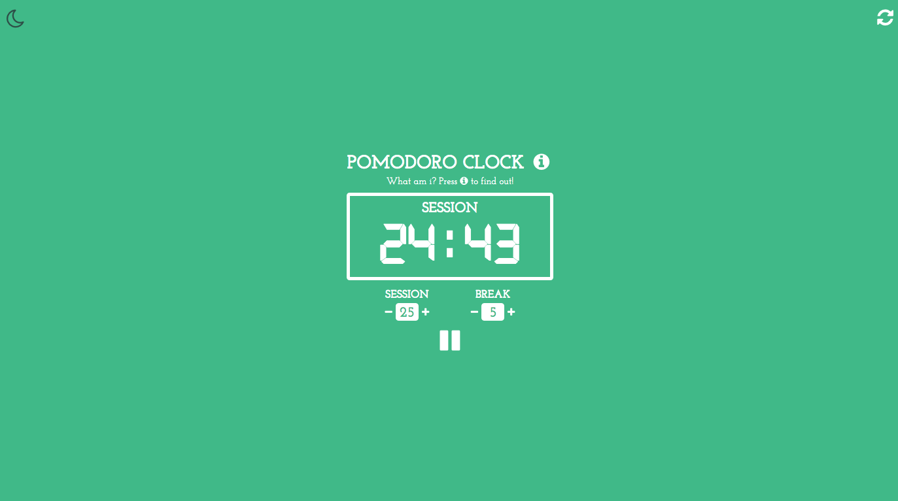
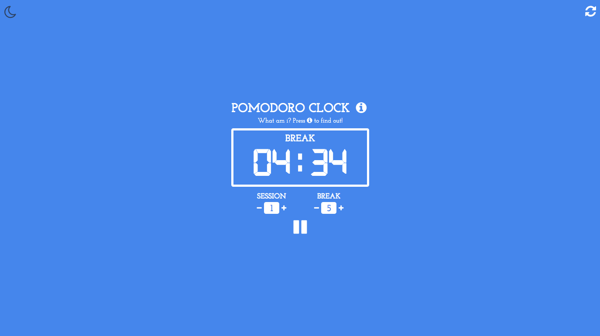
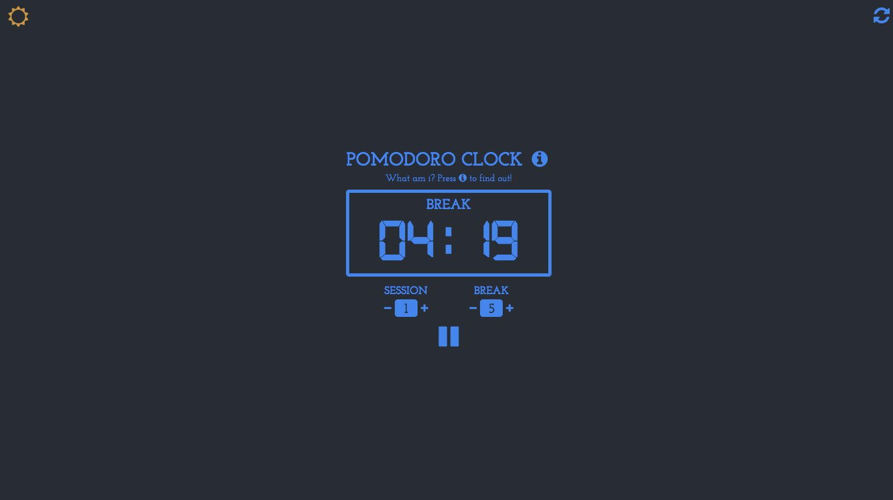

# Pomodoro Clock

This project was completed as part of the Free Code Camps Front End Libraries Assignment.

This project was created using React and bootstrapped with [Create React App](https://github.com/facebook/create-react-app).

The aim of the project was to create a pomodoro clock that helps increase productivity by having regular timed breaks using a interval method. React was used to rerendered components all around the page as the timer decreased, changed and finished. A few other features were added to this to increase the functionality of the app and make it more user friendly.

# 

## Table of contents

1. [Demo](#demo)
2. [Technologies](#technologies)
3. [Features](#features)
4. [Development](#development)
5. [License](#license)

## Demo

Here is the working live demo:
[https://benjamin-gambling.github.io/pomodoro-clock/](https://benjamin-gambling.github.io/pomodoro-clock/).

## Technologies

- [ReactJS](https://reactjs.org/)

  

## Features

- Using the Pomodoro Technique produced a timer that helps manage productivity ensuring regular breaks
- Adjustable timers to meet user needs
- Every 4th break is twice as long
- Audio plays when timer reaches 0
- Color modes that help reflect the state of user during the timer

* Working - Concentration - Green
* Break - Relax/Calm - Blue
* Stopped - Red

- Night/Light mode toggles between dark background and light but keeping the mood colors with the bodies text
- Designed for mobile and browser use
- Simple design to avoid distraction from purpose
- Title changes so tab displays time remains

> Break Mode

# 

> Dark Mode

# 

### Development

- Develop to IOS/Android app
- Add function that automatically puts into dark mode an certain times of day

## License

> You can check out the full license [here](LICENSE)

This project is licensed under the terms of the **MIT** license.
